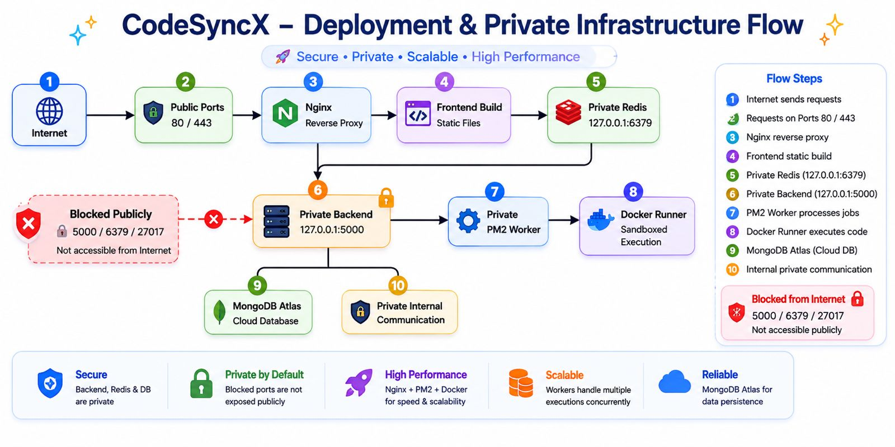
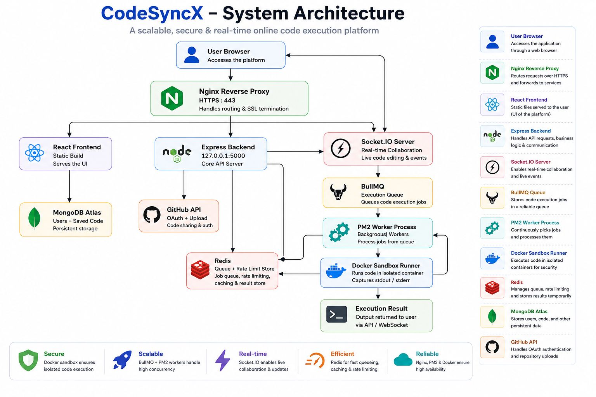
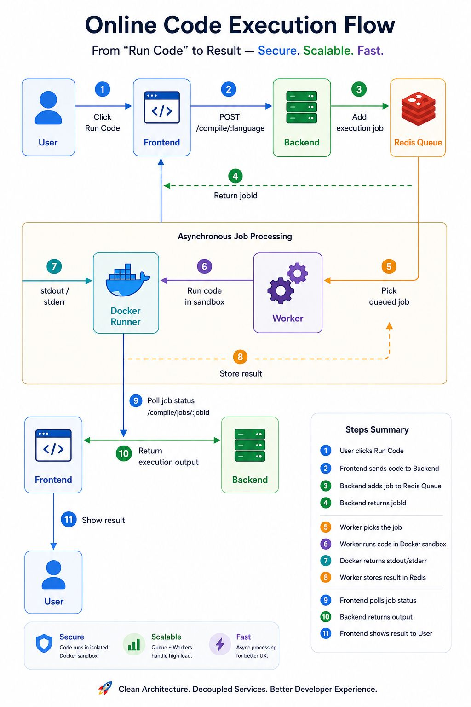
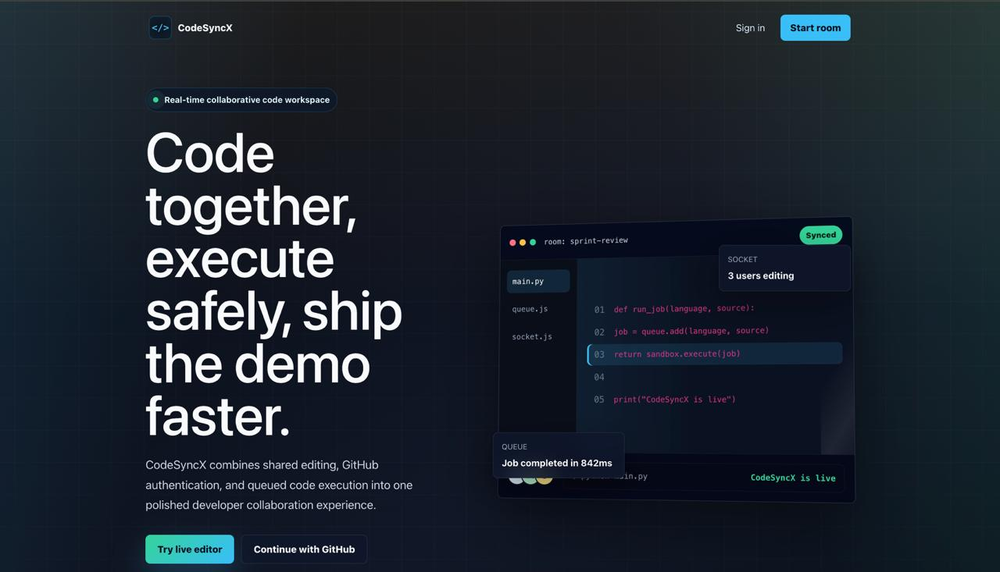
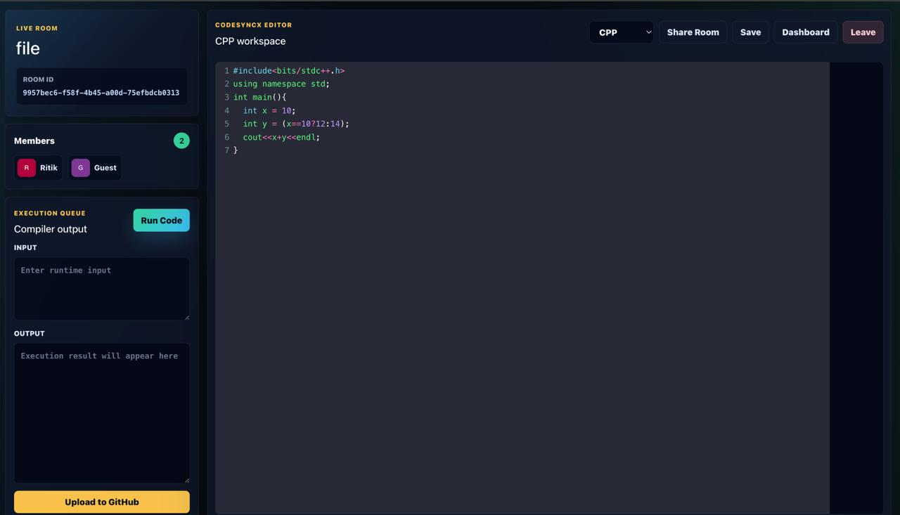
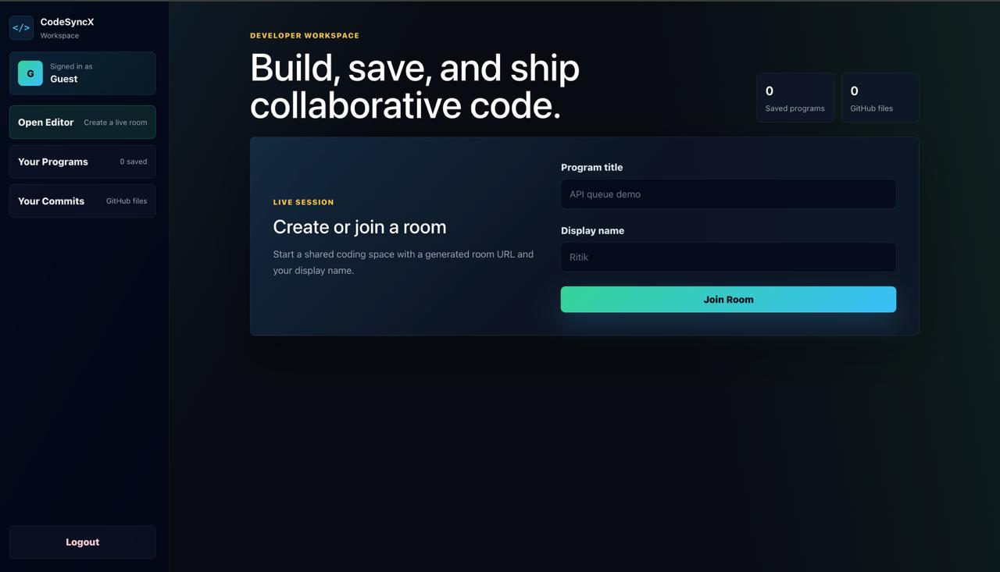
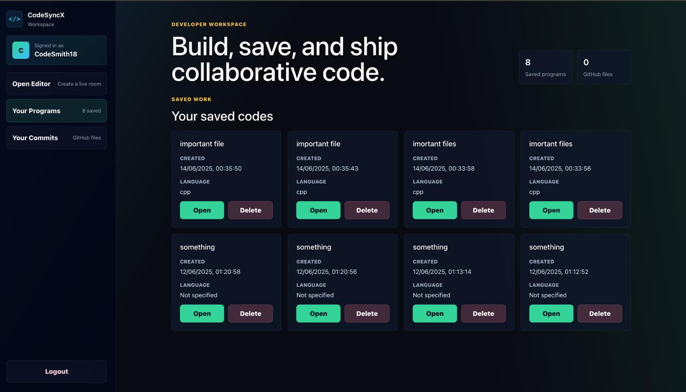
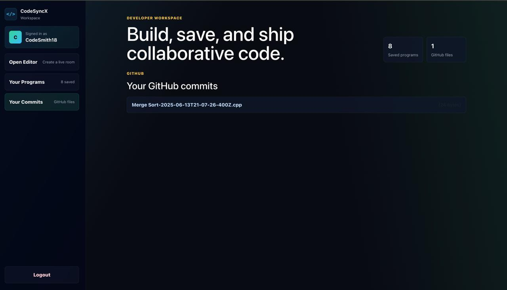

# CodeSyncX

🚀 Live Demo: https://codesyncx.ritik18.online

CodeSyncX is a real-time collaborative code editor built with React, CodeMirror, Express, Socket.IO, Redis, BullMQ, Docker, and MongoDB. Users can create shared coding rooms, collaborate live, execute code in multiple languages, save programs, and upload editor contents directly to GitHub.

---

# Features

- Real-time collaborative editing using Socket.IO rooms
- Browser-based code editor powered by CodeMirror
- Multi-language code execution support
- Secure JWT authentication system
- GitHub OAuth login and repository upload support
- Saved programs dashboard backed by MongoDB
- Shareable coding room links
- Redis + BullMQ powered execution queue
- Docker sandbox based isolated code execution
- Production deployment on AWS EC2 with Nginx and PM2

---

# Live Deployment

🌐 https://codesyncx.ritik18.online

---

# Screenshots

## 1. Deployment & Private Infrastructure Flow


## 2. Complete System Architecture


## 3. Online Code Execution Pipeline


## 4. Landing Page / Hero Section


## 5. Real-time Collaborative Editor Workspace


## 6. Room Creation & Developer Dashboard


## 7. Saved Programs Dashboard


## 8. GitHub Upload & Commit Integration

---

# Architecture Overview

## High-Level System Design

- Frontend built using React and CodeMirror
- Backend powered by Node.js and Express
- Real-time communication using Socket.IO
- Redis and BullMQ used for scalable job queue management
- Docker sandbox execution for isolated code compilation
- MongoDB Atlas for persistent cloud database storage
- AWS EC2 deployment with PM2 and Nginx reverse proxy

---

# Tech Stack

## Frontend

- React.js
- React Router
- CodeMirror
- Socket.IO Client

## Backend

- Node.js
- Express.js
- Socket.IO

## Database

- MongoDB
- Mongoose

## Authentication

- JWT Authentication
- bcrypt
- GitHub OAuth

## Infrastructure

- Redis
- BullMQ
- Docker
- PM2
- Nginx
- AWS EC2

## APIs

- GitHub API using Octokit

---

# Highlights

- Built scalable collaborative editor architecture using Socket.IO rooms
- Implemented Redis-backed execution queue using BullMQ
- Designed Docker-based isolated execution sandbox for secure compilation
- Deployed production-ready infrastructure on AWS EC2 using PM2 and Nginx
- Integrated GitHub OAuth authentication and repository upload functionality

---

# Supported Languages

The current compiler API supports:

- C++
- Java
- Python

---

# Prerequisites

- Node.js 20
- MongoDB local instance or MongoDB Atlas URI
- Redis server
- Docker (for sandbox execution)
- GitHub OAuth App

If using nvm:

```bash
nvm use
```

---

# Environment Variables

## Backend Environment

Create `backend/.env` from `backend/.env.example`:

```env
PORT=5000
MONGO_URL=mongodb://127.0.0.1:27017/codesyncx
JWT_SECRET=change_me
GITHUB_CLIENT_ID=your_github_client_id
GITHUB_CLIENT_SECRET=your_github_client_secret
GITHUB_CALLBACK_URL=http://localhost:3000/login
SESSION_SECRET=change_me
REDIS_URL=redis://127.0.0.1:6379
SOCKET_REDIS_ADAPTER_ENABLED=false
REDIS_RATE_LIMIT_ENABLED=false
EXECUTION_MODE=local
```

For MongoDB Atlas:

```env
MONGO_URL=mongodb+srv://...
```

## Frontend Environment

Create `client/.env` from `client/.env.example`:

```env
REACT_APP_BACKEND_URL=http://localhost:5000
REACT_APP_GITHUB_CLIENT_ID=your_github_client_id
```

For local GitHub OAuth testing:

```text
http://localhost:3000/login
```

---

# Local Setup

## Install Dependencies

```bash
npm run install:all
```

## Start Backend

```bash
npm run dev:backend
```

## Start Worker

```bash
npm run dev:worker
```

## Start Frontend

```bash
npm run dev:client
```

Open:

```text
http://localhost:3000
```

---

# Production Deployment

Recommended production architecture:

- Nginx serves frontend build files
- Nginx proxies backend APIs and Socket.IO
- PM2 manages backend API and worker processes
- Redis runs using Docker Compose
- MongoDB Atlas handles persistent storage
- Docker sandbox executes user code securely

## Health Check Endpoints

```text
http://localhost:5000/health
http://localhost:5000/health/redis
```

---

# System Design Infrastructure

Code execution is queued through Redis and BullMQ and processed by a dedicated execution worker.

Execution modes:

- Local execution mode for development
- Docker sandbox mode for isolated secure execution

Infrastructure includes:

- Redis-based queue management
- Socket.IO Redis adapter support
- Docker sandbox execution
- Rate limiting support
- PM2 process management

---

# Core Features Showcase

✅ Real-time collaborative coding

✅ Multi-language code execution

✅ GitHub OAuth authentication

✅ GitHub repository upload support

✅ Saved programs dashboard

✅ Room-based collaboration

✅ Redis + BullMQ execution queue

✅ Docker sandbox execution

✅ AWS EC2 production deployment

---

# Known Limitations

- Docker sandbox execution requires Docker and the `codesyncx-runner` image
- Collaborative room state is currently in-memory
- Persistent room recovery is planned for future releases
- GitHub upload currently targets the `CodeSync` repository

---

# Future Improvements

- Persistent collaborative room recovery
- Multi-file project support
- Custom runtime environments
- Kubernetes-based scaling
- AI-assisted code collaboration
- Voice collaboration support

---

# Repository Topics

Recommended GitHub topics:

```text
react
nodejs
socketio
mongodb
redis
bullmq
collaborative-editor
system-design
docker
aws
realtime-app
```

---

# Author

Ritik Raj

- MERN Stack Developer
- Competitive Programmer
- System Design Enthusiast
- Electronics and Communication Engineering Student at BIT Mesra

---

# License

This project is licensed under the MIT License.

